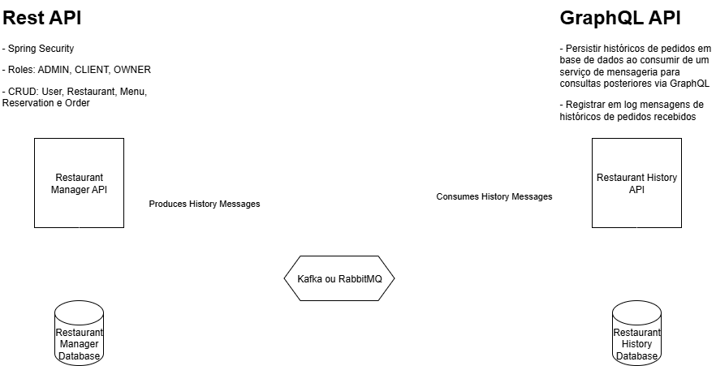

# FTC.RestaurantHistory.API

Este serviço é responsável por consumir eventos de pedidos (`Order`) e reservas (`Reservation`) de um tópico Apache Kafka e persistir um histórico de pedidos e reservas para os restaurantes.

## Diagrama de Arquitetura

O diagrama abaixo ilustra a arquitetura e o fluxo de dados do serviço:

